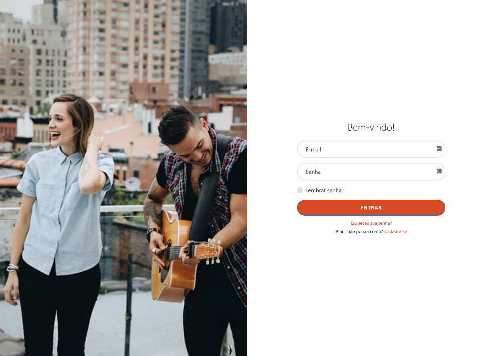
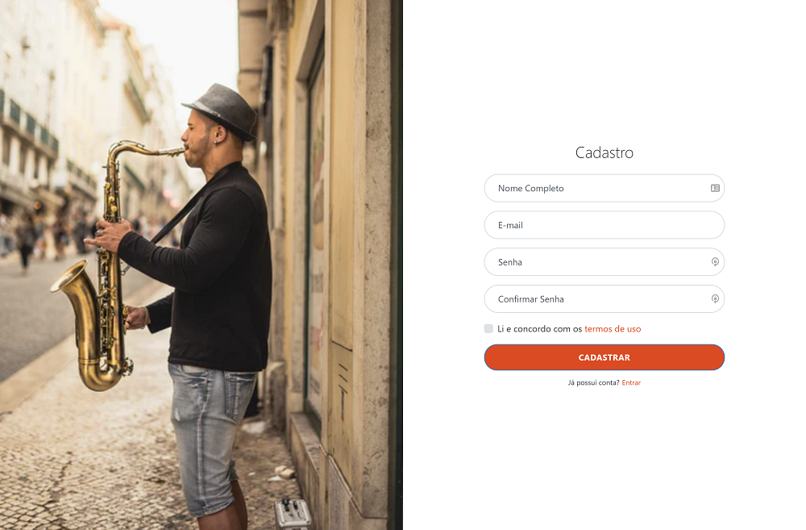

<h1 align="center">Sign In Template - Bootstrap 4</h1>

Front-end template for login, registration and password recovery pages. It was used as a base, a template found on the website: <a href="https://startbootstrap.com/snippets/sign-in-split/" target="_blank">Startbootstrap</a>

<h2>How to get started ?</h2>
<ul><li>
Copy the link to clone the repository
</li></ul>
<pre><code>https://github.com/Lucas98Fernando/SignInTemplate.git</code></pre>

<ul><li>
Clone the repository on your computer, using Git Bash, using the following command:
</li></ul>
<pre><code>git clone https://github.com/Lucas98Fernando/SignInTemplate.git FolderName</code></pre>

<h2><strong>Great, now you just have to open the files in your code editor and make the changes you want, have fun!<strong></h2>
